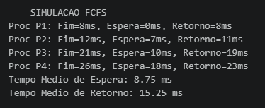
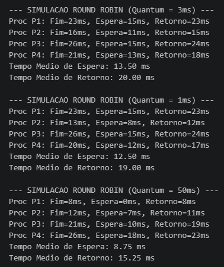

# Laboratório 02 — Simulação e Avaliação de Desempenho de Algoritmos de Escalonamento de CPU

## 1. Identificação

**Disciplina:** Sistemas Operacionais  
**Curso:** Análise e Desenvolvimento de Sistemas (ADS)  
**Semestre:** 4º Semestre / 2026.2  
**Atividade:** Roteiro de Laboratório 02

## 2. Objetivo

O presente laboratório tem como objetivo analisar o comportamento de algoritmos de escalonamento de CPU por meio de simulação computacional, considerando as métricas de **tempo de espera** e **tempo de retorno**.

Foram analisados os seguintes algoritmos:

- **FCFS (First-Come, First-Served)**;
- **Round Robin (RR)**;
- **SJF (Shortest Job First) não-preemptivo**.

## 3. Carga de Trabalho

A simulação foi realizada com quatro processos, definidos conforme o roteiro da atividade:

| Processo | Chegada (ms) | Duração/Burst (ms) | Prioridade |
|---|---:|---:|---:|
| P1 | 0 | 8 | 3 |
| P2 | 1 | 4 | 1 |
| P3 | 2 | 9 | 4 |
| P4 | 3 | 5 | 2 |

## 4. Análise do FCFS

No algoritmo FCFS, os processos são executados de acordo com a ordem de chegada à fila de prontos.

A sequência observada foi:

```text
0        8       12               21      26
|---P1---|--P2---|------P3--------|--P4---|
```

O processo P1 foi executado primeiro por ter chegado no instante 0 ms. Como sua duração é de 8 ms, o processo P2, apesar de possuir duração menor, permaneceu aguardando até a finalização de P1.

Esse comportamento caracteriza o **efeito comboio**, no qual processos menores podem apresentar maior tempo de espera em razão da execução prévia de um processo mais longo.

### Resultados do FCFS

| Processo | Finalização | Espera | Retorno |
|---|---:|---:|---:|
| P1 | 8 ms | 0 ms | 8 ms |
| P2 | 12 ms | 7 ms | 11 ms |
| P3 | 21 ms | 10 ms | 19 ms |
| P4 | 26 ms | 18 ms | 23 ms |

**Tempo médio de espera:** 8,75 ms  
**Tempo médio de retorno:** 15,25 ms

### Evidência



## 5. Análise do Round Robin

O algoritmo Round Robin foi analisado com diferentes valores de quantum, de modo a observar o impacto desse parâmetro sobre a alternância entre os processos.

### Quantum de 3 ms

**Tempo médio de espera:** 13,50 ms  
**Tempo médio de retorno:** 20,00 ms

Com quantum de 3 ms, os processos são interrompidos ao final de cada fatia de tempo caso ainda possuam tempo restante de execução.

### Quantum de 1 ms

**Tempo médio de espera:** 12,50 ms  
**Tempo médio de retorno:** 19,00 ms

A redução do quantum para 1 ms aumenta a frequência de alternância entre os processos. Consequentemente, há maior quantidade de trocas de contexto, o que pode aumentar a sobrecarga de gerenciamento do processador.

### Quantum de 50 ms

**Tempo médio de espera:** 8,75 ms  
**Tempo médio de retorno:** 15,25 ms

Com quantum de 50 ms, todos os processos conseguem concluir sua execução antes do término da fatia de tempo. Assim, para esta carga de trabalho, o comportamento do Round Robin aproxima-se do FCFS.

### Comparação dos valores de quantum

| Quantum | Espera Média | Retorno Médio |
|---|---:|---:|
| 1 ms | 12,50 ms | 19,00 ms |
| 3 ms | 13,50 ms | 20,00 ms |
| 50 ms | 8,75 ms | 15,25 ms |

### Evidência



## 6. Resolução Manual do SJF Não-Preemptivo

No SJF não-preemptivo, o processo de menor duração é selecionado entre aqueles que já se encontram disponíveis na fila de prontos.

No instante inicial, somente P1 está disponível, portanto ele é executado primeiro. Após sua finalização, P2, P3 e P4 já estão disponíveis. Entre eles, P2 possui a menor duração, seguido por P4 e, por último, P3.

A ordem de execução é:

```text
P1 → P2 → P4 → P3
```

Representação temporal:

```text
0        8       12      17                26
|---P1---|--P2---|--P4---|------P3---------|
```

### Resultados do SJF

| Processo | Chegada | Duração | Finalização | Retorno | Espera |
|---|---:|---:|---:|---:|---:|
| P1 | 0 | 8 | 8 | 8 | 0 |
| P2 | 1 | 4 | 12 | 11 | 7 |
| P4 | 3 | 5 | 17 | 14 | 9 |
| P3 | 2 | 9 | 26 | 24 | 15 |

**Tempo médio de espera:**

```text
(0 + 7 + 9 + 15) / 4 = 7,75 ms
```

**Tempo médio de retorno:**

```text
(8 + 11 + 14 + 24) / 4 = 14,25 ms
```

## 7. Análise Comparativa

| Algoritmo | Espera Média | Retorno Médio |
|---|---:|---:|
| FCFS | 8,75 ms | 15,25 ms |
| Round Robin (3 ms) | 13,50 ms | 20,00 ms |
| SJF não-preemptivo | 7,75 ms | 14,25 ms |

Para a carga de trabalho utilizada, o SJF não-preemptivo apresentou os menores valores médios de espera e de retorno.

O FCFS apresentou valores intermediários, porém evidenciou o efeito comboio. O Round Robin, por sua vez, apresentou maior alternância entre os processos e mostrou-se sensível ao valor adotado para o quantum.

## 8. Conclusão

A atividade permitiu comparar, na prática, diferentes estratégias de escalonamento de CPU. Os resultados demonstraram que a escolha do algoritmo influencia diretamente o tempo de espera, o tempo de retorno e a frequência de alternância entre os processos.

Também foi possível observar que o tamanho do quantum exerce influência significativa sobre o comportamento do Round Robin. Para a carga de trabalho analisada, o SJF não-preemptivo apresentou os menores tempos médios, enquanto o FCFS evidenciou o efeito comboio.

## 9. Execução do Projeto

Para executar o simulador:

```bash
python simulador_escalonador.py
```

## 10. Estrutura do Repositório

```text
lab-02/
├── simulador_escalonador.py
├── README.md
└── evidencias/
    ├── fcfs_rr3.png
    └── quantum_1_50.png
```
